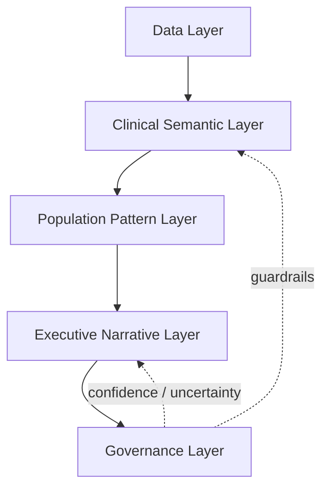

# Health Dynamics

Starter project for a Flask application using SQLAlchemy, SQLite, and Bulma.

## Structure

```text
health-dynamics/
├── app/
│   ├── __init__.py
│   ├── models.py
│   ├── views.py
│   ├── forms.py
│   ├── templates/
│   └── static/
├── etl/
├── analytics/
├── warehouse/
├── data/
│   ├── raw/
│   └── processed/
├── tests/
├── config.py
├── run.py
├── requirements.txt
└── README.md
```

## Architecture

Health Dynamics currently uses a simple interpretation flow for health checkup data, with the local application and knowledge notes focused on lightweight analytics and executive-facing summaries. The current implementation stays intentionally conservative: the system can store, retrieve, and summarize health information, but it should not be treated as a diagnostic engine.

### Current Direction

- Raw data is ingested from checkup sources and organized for analysis.
- Rule-based or explicitly defined analytics produce structured health statuses.
- Knowledge notes provide short population-health guidance for briefing pages.
- The local LLM can be used to generate narrative summaries from structured context.

### Future Direction: Health Intelligence Interpretation Layer

The long-term architecture should evolve from a simple rule-based health status classifier into a governed Health Intelligence Layer for longitudinal population health analytics.



This layered model separates raw data handling from semantic interpretation, population analytics, narrative generation, and interpretation governance.

#### Data Layer

The Data Layer stores and organizes:

- raw health checkup data
- snapshots of each annual or periodic checkup
- longitudinal records across multiple years
- analytics outputs and derived indicators

Its role is to preserve source fidelity and provide a consistent foundation for downstream interpretation.

#### Clinical Semantic Layer

The Clinical Semantic Layer converts raw measurements into structured meanings such as:

- normal, borderline, and abnormal classifications
- trajectories over time
- persistence of abnormal findings
- transitions between health states

This layer should reason over repeated observations, not just single values.

#### Population Pattern Layer

The Population Pattern Layer identifies organization-level and cohort-level patterns such as:

- emerging risk
- persistent burden
- recovery
- volatility
- mixed or clustered risk patterns

This layer focuses on what the data means across groups and across time, rather than only at the individual test level.

#### Executive Narrative Layer

The Executive Narrative Layer converts structured findings into plain-language summaries for:

- executives
- HR personnel
- organizational decision makers

This layer should explain what is happening, why it matters, and what pattern is emerging, while staying grounded in the structured interpretation produced upstream.

#### Governance Layer

The Governance Layer applies interpretation guardrails, including:

- confidence scoring
- uncertainty handling
- limits on conclusions when data is incomplete or inconsistent
- restrictions on medical recommendations

This layer ensures the system remains decision-support oriented rather than a replacement for clinical judgment.

### Health Archetypes

Future versions of the system should support population-level archetypes derived from longitudinal patterns, not from single test results. Examples include:

- Stable Healthy
- Emerging Risk
- Persistent Burden
- Improving Recovery
- Mixed Metabolic Risk
- Volatile Pattern

These archetypes should summarize recurring trajectories and pattern combinations across years of data.

### Longitudinal Interpretation Enhancements

Future interpretation logic should support:

- multi-year trajectory analysis
- persistence detection across multiple years
- recovery pattern detection
- silent deterioration detection
- population volatility analysis

The objective is to move from snapshot interpretation to time-aware interpretation.

### Confidence and Uncertainty

Future interpretations may include confidence levels informed by:

- number of years available
- sample size
- missing data
- consistency of observed patterns
- magnitude of change
- agreement across multiple indicators

This lets the system communicate when an interpretation is strong, tentative, or underdetermined.

### Knowledge Model and Domain Semantics

Future logic should group indicators into health domains rather than treat each lab value independently. Example domains include:

- Lipid profile: LDL, HDL, cholesterol, triglycerides
- Metabolic profile: glucose, BMI, triglycerides
- Liver-related indicators: AST, ALT
- Kidney/metabolic excretion indicators: BUN, creatinine, uric acid

The system should reason over these domains to produce more clinically meaningful and longitudinally stable interpretations.

### LLM Integration Principles

The architecture should preserve a clear separation of responsibilities:

- Rules, analytics, and semantic logic determine interpretations.
- LLMs generate explanations and narratives.
- LLMs should not independently determine health classifications.

The preferred flow is:

```text
Data -> Analytics -> Semantic Interpretation -> Structured Findings -> LLM Narrative
```

not:

```text
Data -> LLM -> Interpretation
```

This keeps the interpretation layer governed, auditable, and reproducible.

### Research Vision

The long-term objective is to create a longitudinal, guardrail-based health intelligence system that transforms repeated health checkup data into interpretable population health archetypes, confidence-rated insights, and executive decision-support narratives.

## Setup

1. Create and activate a virtual environment.
2. Install dependencies with `pip install -r requirements.txt`.
3. Start the app with `python run.py`.

To inspect an Excel file without loading it into the database, run
`python etl/explore_excel.py /path/to/workbook.xlsx`.

## Local LLM

Health Dynamics can connect to a local Ollama model through an OpenAI-compatible API.

1. Install Ollama from [ollama.com](https://ollama.com/).
2. Pull the configured model:

```bash
ollama pull ministral-3:3b
```

3. Create a local environment file from the example:

```bash
cp .env.example .env
```

4. Ensure `.env` contains the local LLM settings:

```dotenv
LOCAL_LLM_BASE_URL=http://localhost:11434/v1
LOCAL_LLM_MODEL=ministral-3:3b
LOCAL_LLM_API_KEY=ollama
```

5. Start Ollama so the local API is available.
6. Test the connection:

```bash
python analytics/llm_client.py
```

The test command loads environment variables from `.env`, connects to the configured local model, and asks it to summarize the health dashboard in one paragraph.

The ETL, analytics, and warehouse layers are intentionally left unimplemented for now. The future interpretation architecture above describes how those layers can evolve into a governed health intelligence pipeline without changing the current app's conservative, summary-oriented behavior.
