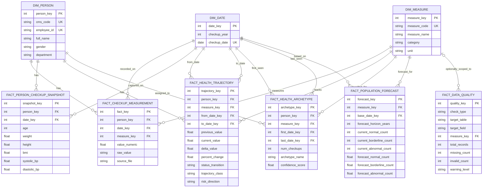

# Data Warehouse ER Diagram

This Mermaid ER diagram reflects the current warehouse tables defined in [app/models.py](/Users/likitpreeyanon/projects/health-dynamics/app/models.py) and present in `health_dynamics.db`.

## Notes

- `fact_checkup_measurement` is the central granular fact table.
- `fact_person_checkup_snapshot` is a denormalized per-person, per-checkup summary.
- `fact_health_trajectory` and `fact_health_archetype` are derived analytical facts built from repeated measurements over time.
- `fact_population_forecast` is aggregated at the measure and base-date level, not the person level.
- `fact_data_quality` is an audit fact table and only links to `dim_measure` when a check is measure-specific.
- `executive_brief` and `exploration_brief` exist in the same database but are application output tables, not part of the warehouse star schema.
